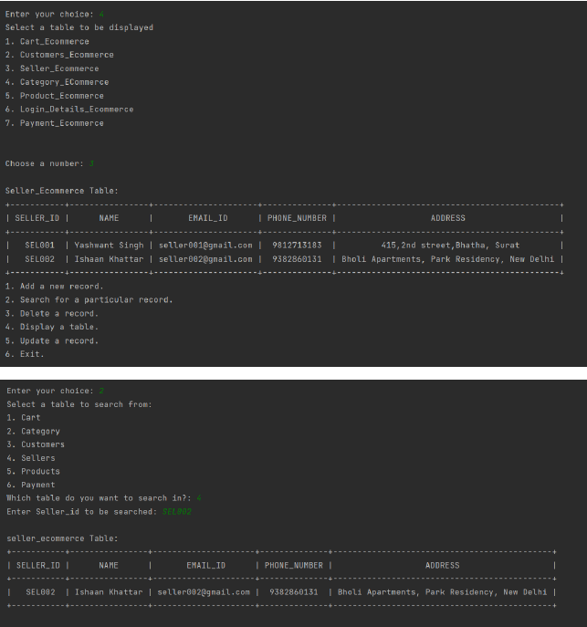

**Project Title: eCommerce Database Management System (DBMS)**

**Description:**
🛒✨ Dive into the world of efficient eCommerce database management with our comprehensive system, designed to streamline operations and enhance your online retail experience. This project, developed using Python and Oracle Database, offers a robust interface for managing multiple database tables, incorporating operations such as search, update, and delete. Leverage the power of SQL triggers and cursors to maintain data integrity and optimize database interactions.

**Key Features:**
- **User-Friendly Interface:** A menu-driven interface simplifies database management, allowing users to perform operations seamlessly.
- **Table Operations:** Perform CRUD (Create, Read, Update, Delete) operations on multiple database tables crucial for eCommerce functionality.
- **Python SQL Connectivity:** Utilize Python's capabilities to interact with the Oracle Database, enhancing the system's flexibility and ease of use.
- **Access Control:** Ensure secure access to the system by requiring usernames and passwords. Only authorized users can interact with the database.

**Technologies Used:**
- **Python:** Primary language for building the interface and connecting with the database.
- **Oracle Database:** The backbone of our eCommerce DBMS, storing and managing data efficiently.
- **SQL:** Employed for defining, manipulating, and querying the database tables.
  
**Access Control:**
- To access the database, provide valid usernames and passwords. Update the credentials in the designated file (`credentials.txt` or as per your project structure).

**How to Use:**
1. Install the required dependencies (specify them, if any).
2. Configure the Oracle Database connection details and user credentials.
3. Run the Python script (`main.py` or as per your project structure) to launch the eCommerce DBMS interface.
4. Navigate through the menu to perform various operations on the database tables.

**Sample Snippet:**

**Contributions:**
Contributions and feedback are welcome! If you have ideas for enhancements or bug fixes, feel free to fork the repository, create branches, and submit pull requests.

**Project Structure:**
- `usingOracle.py`: The main Python script containing the menu-driven interface.
- `CartDeletionTrigger.sql/`: SQL scripts triggers, and other database operations.
- `queries.txt/`: SQL scripts for table creation.
- files and data saved in oracle database

Embark on a journey to streamline eCommerce database management. Optimize your online retail operations with our eCommerce DBMS. Securely manage access with usernames and passwords. Happy coding! 🚀🛍️
